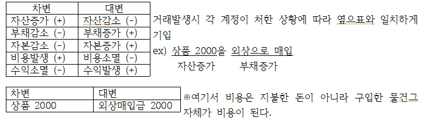
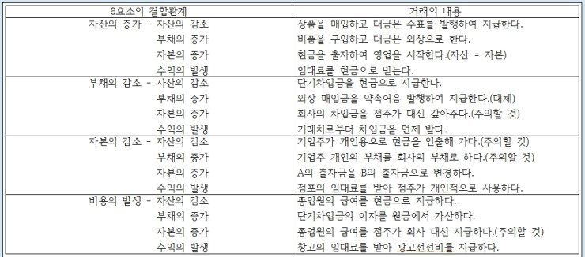
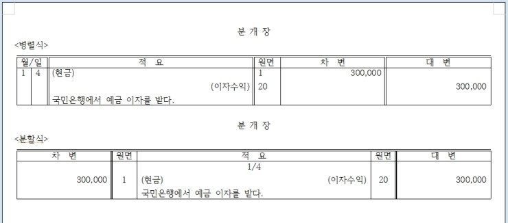
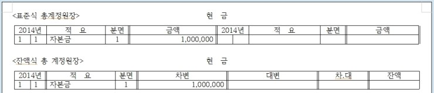

# 회계Accounting 란
 - 부기 Bookkeeping: 기업의 경영활동으로 발생하는 경제적 사건을 기록, 계산, 정리하는 과정.
 - 회계 Accounting : 산출된 회계정보를 기업의 이해관계자들에게 유용한 경제적 정보로 식별, 측정, 전달 하는 과정.

자본 = 자산 - 부채
 
재산법(순자산 비교법) = 기말자본 - 기초자본 = 당기순이익
 
손익법 : 순자산비교법 한기의 계산을 하는 재산법과 달리 일정한 기간의 계산을함 = 총수익 - 총비용 = 순이익.
 
## 계정 Account
거래발생시 재정상태(자산, 자본, 부채)의 증감변화와, 경영성과(수익, 비용)가 발생하는데 이러한걸 구체적 항목별로 기록, 계산하기위해 설정된 계산단위

### 계정의 기입 방법 Method of Account Entry

### 거래의 8요소 결합관계

 
## 장부 Book
기업의 경영활동에서 발생하는 모든 거래를 기록, 계산, 정리하여 기업의 경영활동에 관한 언과관계를 명백히 하기위한 기록상지면.
주요장부는 분개장, 과총계정원장(원장)이 있다.

### 분개장 Journal
거래가 발생하는 순서대로 분개를 기입하는 장부. 병렬식과 분할식이 있다.
 - 분개 : 거래가 발생하면 각 계정에 기입하기위해 거래를 차변과 대변요소로 구분하여 계정에 기입할 계정과목과 금액을 결정하는 것.

### 총계정원장(원장) Ledger
분개장에 기록된 내용을 계정과목별로 전기(분개장에서 총계정원장으로 옮겨 적는것)하여 기록할 수 있도록 모든 계정계좌가 설정되어있는 장부를 말함. 이는 표준식과 잔액식으로 나뉜다.

### 거래의 8요소
결합관계에 의한 거래의 분개는 회계의 기초에서 가장 중요하다. 반드시 숙지하라. 

### 시산표
분개장에서 총계정원장에 전기가 정확하게 되었는가를 검증하기위하여 작성하는 계정집계표. 그 종류는 합계시산표, 잔액시산표, 합계잔액시산표가 있으며 기말자산 + 총비용 = 기말부채 + 기초자본 + 총수익 이라는 사산표등식 성립(기초자본이 사용되는 이유를 이해 할것)

###정산표
원장 각 계정의 마감전 잔액시산표를 기초로 기업재무상태와 경영성과를 개략적으로 알아보기위하여 손익계산서와 대차대조표를 함계 작성한 일람표. 결산의 예비절차, 현행회계순환과정에서는 생략이 일반적. 

### 결산
특정회계연도중에 발생한 모든 거래를 기록한 장부를 회계연도 말에 마감하여 기업의 재무상태와 경영성과를 정확하게 파악하는 절차.

- 결산의 절차 1. 예비절차 : 시산표 작성, 결산정근1사항 수정, 정산표 작성(생략가능)
                        2. 본절차 : 총계정원장의 마감(수익비용계정 → 자산, 부채, 자본 계정), 분개장 및 거래장부의 마감
                        3. 후절차(보고서 작성) : 손익계산서 작성(손익계정을 토대로), 대차대조표 작성(이월시산표를 토대로)
 
※ 총계정원장의 마감 : 
   1. 수익비용계정의 마감
       (1)집합계정인(집합)손익계정을 설정한다.
       (2)수익계정을 손익계정 대변에 대체하고 대체분계한다.
       (3)비용계정을 손익계정 차변에 대체하고 대체분계한다.
       (4)손익계정에 집합(대체)된 대변의 총수익합계와 차변의 총비용합계를 비교하여 차액인 당기순이익(또는 당기순손실)을 자본금 계              정 대변(차변)에 대체하는 대체분개를 한다.
   2. 자산, 부채, 자본 계정의 마감
       (1)자산, 부채, 자본계정의 마감과 이월 : 각 계정의 잔액을 산출금액이 적은 쪽에서 차기이월이라 기입하고 마감하고 다음회계연되                                                                 (개시일)에 차기이월을 기록한 반대쪽에 전기이월이라 개시기입한다.
       (2)이월시산표의 작성 : 마감을 분개없이 하였으므로 이월액의 정확성 여부를 확일할수 없으므로 계정의 이월액이 정확한가를 확인하                                        기 위해 작성하는 표가 이월시산표이다.
 
통화 : 법정통화로서 지폐와 주희
 
통화대용증권 : 수표, 송금환, 배당금영수증, 우편환증서, 등.
 
요구불예금 : 예금자가 인출을 요구하는 즉시 인출할 수 있는 예금으로 당좌예금, 보통예금, 저축예금 등.
 
현금성 자산 : 현금은 아니지만 현금의 전환이 용이한것. 취득당시 만기 3개월 이내에 도래하는것만 기입. 그 기준은
   1. 큰 거래비용없이 현금으로 전환이 용이할것.
   2. 이자율 변동에 따른 가치변동의 위헙이 중요하지 않은것.
   3. 취득일 기준 만기(상환일)가 3개월 이내에 도래할것.
 
현금 과부족 : 현금이 남거나 모자라는 경우 설정되는 일시적 계정과목
   1. 현금부족시 회계처리방법(장부잔액 > 시재액(실재잔액 : 금고보관액))
       - 현금부족은 현금의 감소이므로 차변에 기입.
   2. 현금이 남는 경우 회계처리방법(장부잔액 < 시재액)
       - 현금이 남은것은 현금의 증가이므로 대변에 기입.
 
당좌예금계정 : 기업이 거래은행과 당좌거래계약을 맺고, 현금등을 당좌예입한후, 필요시 수표를 발행하여 인출 사용 할 수 있는 자산계정.
 
당좌차월계정 : 회사가 당좌수표발행시 당좌예금 잔액을 초과하여 발행한 금액을 당좌차월(부채)이라 한다.
 
단기금융상품 : 현금성자산의 기준을 충족시키지 않는것을 분류 대차대조표상의 단기투자자산에 포함. 그 종류는
   1. 은행예금중 저축성예금(정기예금, 정기적금 등)
   2. 사용이 제한되어 있는 예금(감채기금 등)
   3. 기타정형화된 금융상품(양도성 예금증서, 기업어음, 어음관리계좌, 환매조건부 채권, 등)
 
양도성예금증서(CD) : 시중은행에서 발행 판매하는 예금증서, 무기명할인식 선이자 형태의 양도가능 증서.
 
MMF : 투자신탁회사가 고객의 자금을 모아 펀드를 구성, 금리가 높은 단기금융상품에 집중투자하여 얻은 순 이익을 고객에게 돌려주는 금           융상품. 수시로 입출금 가능.
 
발행어음 : 종합 금융사가 자체자금을 조달하기위하여 고객을 수취인으로 하여 종금사를 지급인으로 하여 발행교부되는 약속어음형태의                  금융상품.
 
기업어음 : 기업이 단기적 자금조달을 위해 발행하는 어음. 일반적으로 금융기관이 기업에게 수수료받고 투자자에게 매각.
 
어음관리계좌 : 고객이 맡긴 예금을 투자회사가 어음, 단기채권, 양도성 예금증서, 등에 투자해서 수익을 올린후 고객에게 돌려주는 금융상                      품.
 
환매조건부채권(환매채) : 금융기관이 보유하고잇는 채권을 담보로 제공하고 투자자등의 돈을 모아 다시 채권에 투자하는 금융상품. 금융                                     기관은 일정기간경과후 이자와 원금지금.
 
금권신탁 : 고객의 일시적 여유자금을 은행이 위탁받아 유가증권등에 운용해서 배당해주는 상품.
 
재고자산 : 기업이 정상적인 영업활동과정에서 판매를 목적으로 소유하고 있는 상품의미. 생산중에 있는 자산 또는 판매할 재품을 생산하                  는데 사용된 자산(원재료, 저장품)을 말함.
 
주식발행방법 : 
   1. 액면발행 : 주식에 대한 대가가 주주가 납입하는 현금 혹은 현물자산의 가치가 주식의 액면가액과 동일한경우. 주식발행으로 납입된                        금액중 액면가액에 해당하는 부분은 자본금으로 표시하기 때문에 액면 발행의 경우 전액 자본금.
   2. 할증발행 : 액면가액을 초과하여 주식을 발행하는 경우. 특히 기업이 증권거래소에 상장되어있는 주식을 시가발행할 경우에는 대부분                      액면가액과 다른 가격으로 주식발행 결정.
   3. 할인발행 : 주식을 액면가액 이하로 발행하는 경우
 
자본잉여금 : 증자활동, 감자활동, 기타자본과 관련된 거래(주주와의 거래)에서 발생하여 자본을 증가시키는 잉여금. 자본잉여금거래는 손                   익계산서를 거치지 않고 직접자본에 가감됨.
 
사채 : 기업이 1년이상 사용할 장기 자금을 외부에서 조달할 때 자본금 증가가 아닌 부채의 증가를 통하여 자금을 조달하는 것.
 
시산표 : 거래의 분개가 분개장을 통하여 총계정원장에 정확하게 전기되었는가를 검증하기위하여 작성하는 계정집계표(시산표는 손익을               쓰는게 아니라 상품을 매입과 매출로 나눈다.)
   - 작성목적 : 1. 총계정원장의 기록이 정확한지 검증(대차평균의 원리에 의한 전기의 정확성 여부)
                     2. 합계시산표에 의하여 거래총액을 파악.
                     3. 잔액시산표에 의한 개략적인 재무상태와 경영성과 파악(결산의 예비절차)
   - 오류를 찾는 순서 : 시산표에 대차금액이 일치하지 않는경우 회계순환과정을 역으로(시산표 → 총계정원장 → 분개장 → 분개 → 거래)
                     1. 시산표상의 대차합계를 다시 계산한다.
                     2. 원장에서 시산표에 바르게 옮겼는지 확인.
                     3. 원장 각 계정의 합계액과 잔액 확인.
                     4. 분개장에서 원장으로 바르게 전기되었나 확인.
                     5. 분개장의 분개가 바르게 되었는지 확인.
 
회계에서 인식한다는 의미는 곧 기록의 대상이 된다는 의미이고 일단 인식대상이 되면 순 자산의 변화액(중간액 또는 감소액)을 평가하여 수익과 비용의 금액을 결정하여야 하는데 그것은 측정의 문제라 한다.
 
현금흐름표를 제외한 제무제표는 모두 발생주의(기준)에 따라 작성된다. 이를 발생주의회계라 한다. 우리는 가계부, 소모임회계보고서 등 때문에 현금의 수입과 지출이 있을때만 각각수익과 비용을 인식하는 현금주의 회계에 익숙하다.
 
이연 : 수익, 비용과 관련된 현금수입지출이 이루어졌지만 그 수익, 비용이 인식되는 시점은 미래일정시점까지 연기(이연)되어야 하는 상            황을 처리하는 회계과정. 즉, 현재의 현금 유입액을 장래의 수익인식 목적으로 부채로인식하거나 현재의 현금유출액을 장래의 비용          인식 목적으로 자산으로 인식하는 회계과정.
 
결산정리 : 계정의 기말잔액을 결산시점에서 수정하는것, <기초상품재고액 + 당기상품매입액 = 판매가능액 - 기말상품재고액 = 매출원가>
 
대손 : 회수불능에 빠진 채권, 즉 부실채권을 말한다.
대손처리 : 채권이 회수되지 않을것으로 보고 채권을 장부에서 제거하는것 (상각), 제각이라고도 한다.
대손상각비 : 대손처리해버려 회수되지 않을시 아무대가없이 자산이 감소하는 손실이 발생한다. 이를 대손상각비라 한다.
   - 기록법 : 대손에 관해서 수익.비용댕응의 원칙에 맞게 회계처리하기 위하여 대손이 실제 발생하기전인 매출이 이루어진 연도말에 대손                  을 기록하여야 한다. 이 경우 실제로 대손이 발생하기 이전에 대손금액을 추정해야한다. 따라서 기업은 매출채권의 분석자료                    나 과거 경험을 토대로 하되 경제 및 산업환경의 변화등을 고려하여 대손발생예상액을 측정한다.​ 대손추정액이 정해지면 당기                  말 금액을 바탕으로 대손상각비를 계산하여 비용처리하며 그 상대계정을 대손충당금이라하여 부채의 속성을 갖는 차감적 평                    가계정(평가성충당금)인 대손충당금계정에 기록
 
충당금 설정법 : 대손충당금계정은 대변잔액을 갖는다. 대손충당금을 설정하면 대변잔액이 증가하고 실제 대손이 발생하면 그 만큼 대손충                       당금액이 감소한다.
 
재무재표 : 기업의 경영활동을 재무적(화폐적)으로 표현한 회계보고서. 그 종류로는
   1. 대차대조표(재무상태정보 : 자산, 부채, 자본의 구성에 관한것)
   2. 손익계산서(경영성과정보 : 수익, 비용 및 이익의 내역에 관한것)
   3. 현금흐름표(현금의 흐름정보 : 현금의 원천과 사용에 곤한것)
   4. 자본변동표(자본변동의 내역 : 소유주의 투자 및 소유주에 대한 분배에 관한것)
   5. 이익잉여금 처분계사산서(결손금 처리 계산서)
   6. 주석 및 부속 명세서(중요한 회계방침, 회계변경효과, 기업체의 불확실성이나 위험에 대한 재무제표본문에 표시되지 않는 정보제공)