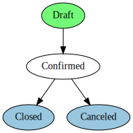

# Workflow
 - 원문 : https://www.odoo.com/documentation/8.0/reference/workflows.html

 Odoo에서 워크플로우는 '해야 할 일'을 조작하기 위한 기술로, 모델의 레코드에 관련되어 있다.
'활동 Activities'으로 불리는 노드에 직접적인 그래프이고 활선은 '전이 Transitions'로 불린다.
 - '활동'은 완료해야 할 작업으로 정의한다. 어떤 레코드의 상태를 변경하거나 이메일을 보내는 등
 - '전이'는 어떻게 워크플로우가 활동에서 활동까지 진행하는지를 조절한다.


기본 주문을 처리하는 워크플로우:



주문은 '임시 Draft' 상태에서 시작해서 사용자가 '확정 Confirmed' 할 수 있고 어떤 경우든 '마감 Closed' 혹은 '취소 Canceled'로 이동한다.


주문에 할인을 추가하고자 하면 판매사원이 15%까지 할인 재량이 있고, 관리자는 15%를 넘는 할일에 대해 검증을 해야 한다고 할 때, 파이썬 혹은 xml 파일을 편집하지 않고 워크플로우는 관련된 단계를 온라인으로 추가할 수 있다.


이것은 활동은 유효한 액션을 이행할 수 있어서 '검증 Validation'은 자동으로 검증 요구를 관련한 직원에게 보낸다.

> 주문뷰는 관리자를 위해서 '할인 수락' 버튼을 추가하게 수정해야 한다.

## Basics
데이터 파일로 워크플로우를 정의하는 것이 직접적이다: 'workflow' 레코드는 활동과 전이에 대한 레코드와 함께 제시한다. 다음은 xml로 두 개의 활동 순서를 선언하고 있다:

```xml
<record id="test_workflow" model="workflow">
    <field name="name">test.workflow</field>
    <field name="osv">test.workflow.model</field>
    <field name="on_create">True</field>
</record>

<record id="activity_a" model="workflow.activity">
    <field name="wkf_id" ref="test_workflow"/>
    <field name="flow_start">True</field>
    <field name="name">a</field>
    <field name="kind">function</field>
    <field name="action">print_a()</field>
</record>
<record id="activity_b" model="workflow.activity">
    <field name="wkf_id" ref="test_workflow"/>
    <field name="flow_stop">True</field>
    <field name="name">b</field>
    <field name="kind">function</field>
    <field name="action">print_b()</field>
</record>

<record id="trans_a_b" model="workflow.transition">
    <field name="act_from" ref="activity_a"/>
    <field name="act_to" ref="activity_b"/>
</record>
```

워크플로우는 항상 특정 모델에 항목으로 정의한다 (모델은 **workflow** 모델 위에 **osv** 애트리뷰트로 주어진다). 활동 혹은 전이에 명시된 메서드는 모델에서 호출될 것이다.

위에서 'test_workflow' 는 두 개의 활동 'a' 와 'b' 그리고 전이 'a' 에서 'b'로 가는 하나의 전이를 만들고 있다.
첫번째 활동에서 **flow_start** 애트리뷰트가 **True**로 설정해서 Odoo는 워크플로우가 인스턴스로 된 후에 어디에서 시작하는지 알 수 있다. 왜냐하면 워크플로우 레코드에서 **on_create** 가 **True**로 설정되어 있기 때문이다. 새로 작성되는 레코드마다 워크플로우 인스턴스를 생성한다.

워크플로우가 생성될 때 액티비티 **a**로 시작한다. 이 액티비티의 **kind**는 **function** 으로 액션 **test_workflow** 모델에서 메서드 **print_a()** 호출을 의미한다. (**cr, uid, ids, context** 인자를 전달한다 )

"a"와 "b" 사이의 전이는 특정 조건이 명시하지 않아서 워크플로우 인스턴스가 즉시 "a"가 처리되고 또한 "b" 활동이 처리된 후에 "a" 에서 "b"로 이동한다


## Activities

