<!-- MarkdownTOC  depth=2 -->

- 모듈 만들기
  - 모듈 Scaffold 사용
  - Template
  - Model
  - Website module
  - URL과 라우팅
  - Administration and ERP integration

<!-- /MarkdownTOC -->


# 모듈 만들기
모듈은 Odoo를 사용자가 원하는 행위를 추가하거나 변경을 가해서 태스크의 양식, 방법으로 바꿀 수 있다.
Odoo에서 새로운 Tasks는 모듈을 작성해서 제공할 수 있다. 

## 모듈 Scaffold 사용
새로운 모듈은 Odoo가 제공하는 부트스트랩인 'Scaffold' 를 이용해서 생성할 수 있다.
 - Scaffold 참조: https://www.odoo.com/documentation/8.0/reference/cmdline.html#reference-cmdline-scaffold

> Odoo 모듈을 작성하기 위해서는 Odoo에 필요한 파이썬의 의존 모듈이 설치되어 있어야 한다.
> ~/odoo$ $pip install -r requirements.txt

### Scafollding
Odoo의 scafold 명령을 잉요해서 기본적인 모듈에 필요한 설정해서 빠르게 시작할 수 있다. 먼저 사용자 홈디렉토리에 'odoomodules' 폴더를 만들어 이곳을 모듈 작업디렉토리로 시작한다.
```
~$ mkdir odoomodules
~$ cd odoo
~$ ./odoo.py scaffold Academy ../odoomodules
```

 
결과는 명령이 실행된 디렉토리에 'my-modules' 모듈 디렉토리가 생성된다. 이 디렉토리는 academy 모듈을 포함 생성한다. 새로운 모듈이 **{ODOO_HOME}/addons** 모듈 디렉토리에 있을 수 있지만 새로운 모듈 디렉토리 이름은 유일해야 한다.

> Mac에서 scafold 명령 수행시 에러가 발생한다. **UnboundLocalError: local variable 'printer' referenced before assignment** 에러가 발생하면 **odoo/addons/hw_escpos/controllers/main.py** 파일의 150 라인에 임시로 **printer = None** 을 추가해 준다.


새로 작성한 모듈과 Odoo를 시작해 보자  
```
~odoo$ ./odoo.py -w odoo -r odoo --addons-path=addons,../odoomodules --db_host localhost --db_port 49153

```


브라우저에서 Odoo를 접속한다:  http://localhost:8069
> 데이터베이스가 생성되어 있지 않다면 데이터베이스를 생성하고 진행한다.

'설정' -> Modules -> Local Modules 로 이동해서 오른쪽 상단의 검색 창에 'Academy' 모듈 이름으로 검색한다.

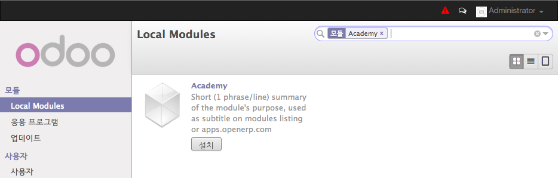

[그림. Local Modules에서 검색한 'Academy']


### 웹 브라우저
'[Controllers](https://www.odoo.com/documentation/8.0/reference/http.html#reference-http-controllers)' 는 브라우저 요청을 가로채고 그래서 모듈이 요청을 받으면 결과를 데이터를 반환해 준다. 다음 같이 간단한 academy/controller.py를 추가하면, 이 controller는 **__init__.py** 에서 임포트한다.

파일: academy/controllers.py
```python
# -*- coding: utf-8 -*-
from openerp import http

class Academy(http.Controller):
    @http.route('/academy/academy/', auth='public')
    def index(self, **kw):
        return "Hello, world"

```
 - '/academy/academy' 로 요청을 받으면 index() 함수가 실행되어 브라우저에 'Hello, world' 가 출력된다.


터미널에서 시작한 Odoo를 **^C**로 종료하고 재시작합니다:

```bash
~odoo$ ./odoo.py -w odoo -r odoo --addons-path=addons,../odoomodules --db_host localhost --db_port 49153
```

그리고 브라우저에서 'Academy' 모듈을 시작합니다. http://localhost:8069/academy/academy/
브라우저에 'Hello, World' 가 출력되는 것을 확인할 수 있습니다.


## Template
파이썬 템플레이트 시스템을 사용해서 웹 디스플레이 로직을 사용할 수 있다. Odoo는 [QWeb](https://www.odoo.com/documentation/8.0/reference/qweb.html#reference-qweb) 템플릿 시스템을 통합해 사용하고 있다.

새로운 템플릿 파일을 작성하면 **__openerp__.py** 명세서에 등록되야 하고 템플릿을 사용해 컨트롤러를 교체한다.

파일: academy/controllers.py
```python
# -*- coding: utf-8 -*-
from openerp import http

class Academy(http.Controller):
   @http.route('/academy/academy/', auth='public')
   def index(self, **kw):
      return http.request.render('academy.index', {
         'teachers': ['고강태', "홍길동", "이이"],
      })

```

QWeb 템플릿 파일은 아래와 같습니다. QWeb 템플릿 지시자는 XML 애트리뷰트에 't-' 로 시자갑니다. 

파일: academy/templates.py
```html
<openerp>
    <data>
        <template id="index">
            <title>Academy</title>
            <t t-foreach="teachers" t-as="teacher">
              <p><t t-esc="teacher"/></p>
            </t>
        </template>
    </data>
</openerp>
```

템플릿에서 t-foreach는 반복문을 구성해서 t-as 변수에 담습니다.

수정한 내용은 설정 -> Modules -> Local Modules -> Academy 에서 Upgrade를 해주면 갱신됩니다.


[그림. Academy 모듈 업그레이드]


#### 모듈관련 시작 옵션
 - -d <database>, --database <database>: 모듈database used when installing or updating modules.

-i <modules>, --init <modules>
comma-separated list of modules to install before running the server (requires -d).

-u <modules>, --update <modules>
comma-separated list of modules to update before running the server (requires -d).

-d와  -u 옵션을 사용해 모듈을 지정하면 모듈 수정시 서버를 재시작 하지 않고 갱신된 모듈을 사용할 수 있다.

```
$ ./odoo.py --addons-path addons/,../odoomodules -r odoo -w odoo -d odoo -u academy --db_host 192.168.59.103 --db_port 49153
...

2015-05-05 11:43:27,013 4354 INFO odoo openerp.modules.loading: loading 1 modules...
2015-05-05 11:43:27,290 4354 INFO odoo openerp.modules.module: module base: creating or updating database tables
```


## Model
Odoo의 [Model](https://www.odoo.com/documentation/8.0/reference/orm.html#reference-orm-model)은 데이터베이스와 연관됩니다. 앞서 문자열 목록을 브라우저에 표시했는데 실제 데이터베이스 데이터를 다루진 못합니다.


### Defining the data model
선생님을 묘사하는 'teacher' 모델을 정의해 보겠다. 모델은 **__init__.py** 에 선언되어 있어야 정확히 적재된다.


파일: academy/model.py
```python
# -*- coding: utf-8 -*-
from openerp import models, fields, api

class academy(models.Model):
     _name = 'academy.academy'

     name = fields.Char()
```

그리고나서 모델에 대해 기본 접근 제어를 설정하고 명세서인 **_openerp__.py**에 기록한다:


파일: academy/__openerp__.py
```python
    # always loaded
    'data': [
        'security/ir.model.access.csv',
        'templates.xml',
    ],
    # only loaded in demonstration mode
```


파일: academy/security/ir.model.access.csv
```python
id,name,model_id:id,group_id:id,perm_read,perm_write,perm_create,perm_unlink
access_academy_teachers,access_academy_teachers,model_academy_teachers,,1,0,0,0
```

이 접근제어 모델은 모든 사용자에게 'perm_read'로 읽기가 가능하게 한다 ('group_id:id' 는 비어 있다. ) 

> 모델의 데이터 파일은 **__openerp__.py** 명세서 파일에 선언되고, 모델이나 컨트롤러 파일에서 적재하지 않느다.

> 그리고 'administrator' 사용자는 접근 제어를 비켜간다.


 
### 데모용 샘플 데이터
다음 같이 xml 로 데이터를 선언해서 사용할 수 있다.
파일: adcademy/demo.xml
```python
<openerp>
    <data>
        <record id="padilla" model="academy.teachers">
            <field name="name">Diana Padilla</field>
        </record>
        <record id="carroll" model="academy.teachers">
            <field name="name">Jody Carroll</field>
        </record>
        <record id="vaughn" model="academy.teachers">
            <field name="name">Lester Vaughn</field>
        </record>
    </data>
</openerp>
```


그리고 **__openerp.py__** 명세서 파일에 데모를 지정한다.

```
'data': [
        'security/ir.model.access.csv',
        'templates.xml',
        'demo.xml',
    ],
```

>Tip
>Data files can be used for demo and non-demo data. Demo data are only loaded in “demonstration mode” and can be used for flow testing and demonstration, non-demo data are always loaded and used as initial system setup.
>In this case we’re using demonstration data because an actual user of the system would want to input or import their own teachers list, this list is only useful for testing.

### 데이터에 접근
모델의 데이터를 템플릿에서 사용하도록 하기 위해서:
1) 데이터베이스에서 레코드를 가져온다
2) search() 에서 일치해서 반환하는 (여기서는 모든 레코드) 레코드를 템플릿에서 프린트한다.

파일: academy/controllers.py
```python
class Academy(http.Controller):
   @http.route('/academy/academy/', auth='public')
   def index(self, **kw):
      Teachers = http.request.env['academy.teachers']
      return http.request.render('academy.index', {
         'teachers': Teachers.search([]),
      })
```

academy/templates.xml
```python
<openerp>
    <data>
        <template id="index">
            <title>Academy Teachers</title>
            <h1>안녕하세요: 선생님!!!</h1>
            <t t-foreach="teachers" t-as="teacher">
              <p><t t-esc="teacher.id"/> <t t-esc="teacher.name"/></p>
            </t>
        </template>
```


## Website module
Odoo에는 Website를 구축 전용 'website' 모듈을 포함하고 있다. controllers에서 직접 사용하고 있는데 website 모듈을 통해서 다른 서비스(예를 들어 styleing, theming) 를 통합할 수 있다. 이를 통해서 Odoo 스타일의 모듈을 만들 수 있게된다.

1) adcademy 모듈에 'website' 의존성을 추가
2) controller에 'website=True' 플래그 추가후 request object에 템플릿에서 사용할 레이아웃 허용.
3) 템플릿에서 웹 사이트 레이아웃 사용.

파일: academy/__openerp__.py
```python
'version': '0.1',
# 다른 모듈을 사용하려면 의존성 추가가 필요
'depends': ['website'],
```


파일: academy/controller.py
```python
# -*- coding: utf-8 -*-
from openerp import http

class Academy(http.Controller):
   @http.route('/academy/academy/', auth='public', website=True)
   def index(self, **kw):
      Teachers = http.request.env['academy.teachers']
      return http.request.render('academy.index', {
         'teachers': Teachers.search([]),
      })
```


파일: academy/template.py
```python
<openerp>
    <data>
        <template id="index">
            <t t-call="website.laytout">
                <t t-set="title">Academy Teachers</t>
                <div class="oe_structure">
                    <div class="container">
                        <h1>안녕하세요: 선생님!!!</h1>
                        <t t-foreach="teachers" t-as="teacher">
                          <p><t t-esc="teacher.id"/> <t t-esc="teacher.name"/></p>
                        </t>
                    </div>
                </div>
            </t>
        </template>
```

이제 서비스를 재시작하고 웹사이트 모듈이 작용할 수 있게 한다.

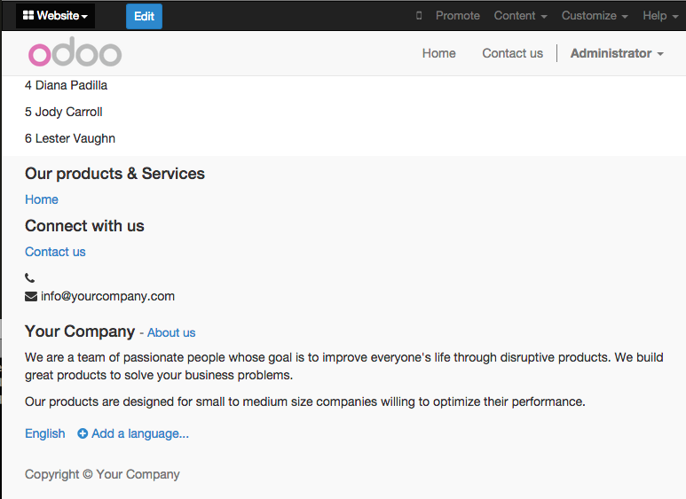
[그림. website 모듈을 추가한 결과]

website 모듈이 지원하는 특징은;
 - 웹사이트를 수정해서 사용할 수 있다.
 - 왼쪽상단의 'Edit' 버튼을 이용해서 기존 내용을 수정하거나 새로운 항목을 추가할 수 있다.

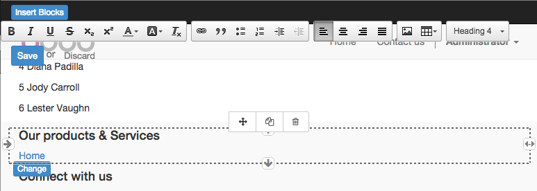
[그림. 화면 구성 내용을 수정할 수 있다.]


## URL과 라우팅
웹 서버에서 라우팅은 서버가 요청받는 URL 경로로서 콘트롤러 메서드는 route() 데코레이터에서 경로 문자열과 기능과 보안을 맞게 설정하는 애트리뷰트를 취해서 경로설정 관계를 맺고 있다.

### 리터럴 라우팅
라우팅 리터럴은 '[converter patterns](http://werkzeug.pocoo.org/docs/routing/#rule-format)' 를 사용해 로컬 변수로 사용이 가능하다. 다음은 '/academy/<name>' 으로 전달된 라우팅 값을 사용한 컨트롤러 예이다.

파일: academy/controllers.py
```python
# -*- coding: utf-8 -*-
from openerp import http

class Academy(http.Controller):
   #...
   @http.route('/academy/<name>/', auth='public', website=True)
   def teacher(self, name):
      return '<h1>{}</h1>'.format(name)
```

이제 서비스를 재시작하고 http://localhost:8069/academy/Alice/ and http://localhost:8069/academy/Bob/ 를 접속하면 다른 결과를 얻는 것을 볼 수 있다.

### Validation & Conversion
'[converter patterns](http://werkzeug.pocoo.org/docs/routing/#rule-format)'이 추출을 의미하지 않고 검증과 변환을 할 수 있어서 전달받은 숫자를 이용해 새로운 컨트롤러로 변경할 수 도 있다.

파일: academy/controllers.py
```python

   ### 5-2 convert pattern
   @http.route('/academy/<int:id>/', auth='public', website=True)
   def teacher(self, id):
      return '<h1>{} ({})</h1>'.format(id, type(id).__name__)
```

재시작을 하고 다음 같이 번호를 입력받으면 해당 번호에 해당하는 커트롤을 처리해 볼 수 있다.

http://localhost:8069/academy/123
http://localhost:8069/academy/2446


### Routing with Model
converter pattern을 사용해서 Model의 ID 값을 전달해 상세 페이지인 biography 페이지로 라우팅합니다.


파일: academy/controllers.py
```python
   @http.route('/academy/<model("academy.teachers"):teacher>/', auth='public', website=True)
   def teacher(self, teacher):
      return http.request.render('academy.biography', {
         'person': teacher
      })
```

새로운 템플릿 레이아웃 'biograpy' 를 추가합니다.

파일: academy/templates.xml
```xml
    </template>
    <template id="biography">
        <t t-call="website.layout">
            <t t-set="title">Academy</t>
            <div class="oe_structure"/>
            <div class="oe_structure">
                <div class="container">
                    <p><t t-esc="person.id"/> <t t-esc="person.name"/></p>
                </div>
            </div>
            <div class="oe_structure"/>
        </t>
    </template>
```

기존 목록 템플릿에서 biography 상세 내용 템플릿으로 연결하게 수정합니다.

파일: academy/templates.xml


### Field 편집
모델에서 레코드로 지정된 데이터는 해당 레코드로 저장합니다. 모델에 biography 필드를 추가합니다.

academy/models.py
```python
    _name = 'academy.teachers'

    name = fields.Char()
    biography = fields.Html()
```

biography 레이아웃은 website 뷰 '<div class="oe_structure"/>' 로 감싸면 내용외에 화면이 구성됩니다.

파일: academy/templates.xml
```xml
    <template id="biography">
        <t t-call="website.layout">
            <t t-set="title">Academy</t>
            <div class="oe_structure"/>
            <div class="oe_structure">
                <div class="container">
                    <h3><t t-esc="person.name"/></h3>
                    <div><t t-esc="person.biography"/></div>
                </div>
            </div>
            <div class="oe_structure"/>
        </t>
    </template>
```

재시작을 하고 목록에서 아이템을 선택하면 biography 페이지가 webview가 제공하는 템플릿 화면데로 보이는 것을 확인할 수 있다.

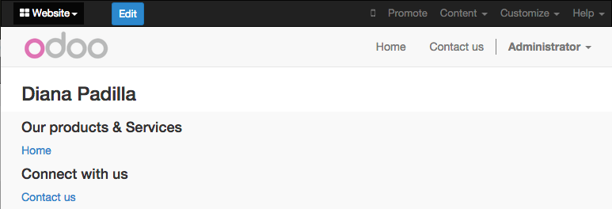

biography 페이지에  **t-field** 지시자를 사용하면 필드를 수정할 수 있습니다.

파일: academy/templates.xml
```xml
        <div class="oe_structure">
            <div class="container">
                <h3 t-field="person.name"/>
                <div t-field="person.biography"/> 
             </div>
        </div>
        <div class="oe_structure"/>
```

모듈 업그레이드 혹은 재시작을 한 후에 상세 화면을 열어보면 'Edit' 버튼이 추가된 것을 확인할 수 있다. 

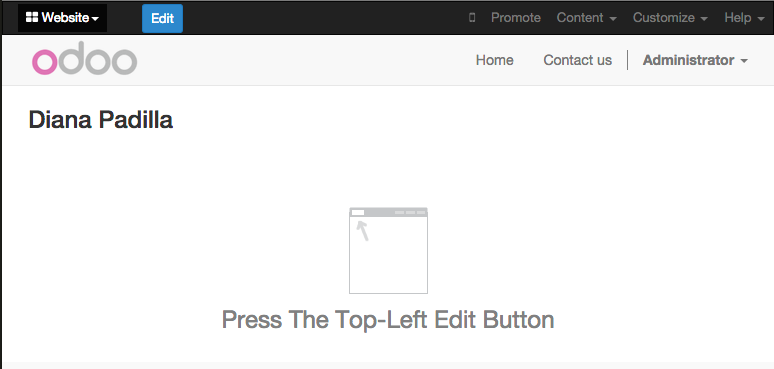
[그림. t-field ]

Edit를 누르고 필드 값을 변경하면 자동으로 모델 데이터도 변경되는 것을 확인할 수 있습니다.
- Content dropped there is stored in the corresponding teacher’s biography field, and thus specific to that teacher.

**t-field**는 또한 포매팅을 선택할 수 있다. 예를 들어 다음 같이 항목 기록에 대한 수정 일자를 표현할 수 있다.

파일: academy/templates.xml
```xml
    <div class="oe_structure">
        <div class="container">
            <t t-foreach="teachers" t-as="teacher">
                <p><a t-attf-href="/academy/{{ slug(teacher) }}"><t t-esc="teacher.name"/></a>
                 <span>Last modified: <i t-field="teacher.write_date" t-field-options='{"format": "long"}'/></span>
                </p>
            </t>
        </div>
    </div>

```


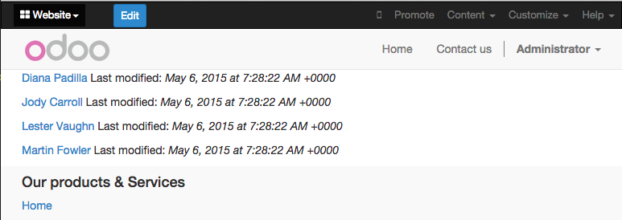
[그림. 아이템 목록에 수정일자 표시 ]


파일: academy/templates.xml
```xml
        <div class="oe_structure">
            <div class="container">
                <h3 t-field="person.name"/>
                <p>Last modified: <i t-field="person.write_date"/></p>
                <div t-field="person.biography"/>
             </div>
        </div>
        <div class="oe_structure"/>
```


## Administration and ERP integration
Odoo의 Administration은 웹으로 .... 메뉴에서 Administration 으로 들어갈 수 있다.

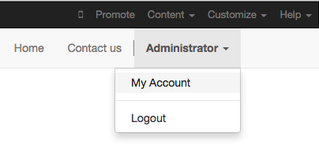  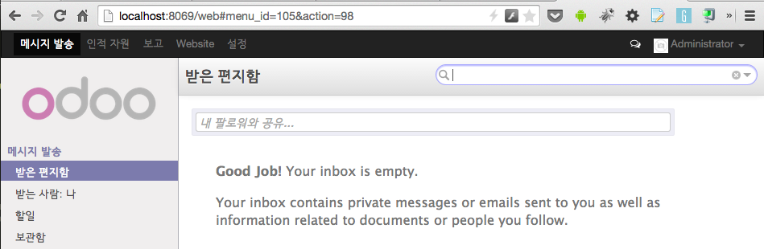

[그림. 관리자 메뉴]


### Odoo Administration

Odoo 백엔드의 구조적 개념
 - 첫번째로 메뉴, 레코드의 트리(메뉴가 가진 서브메뉴) 
 - 액션 - links, reports, 실행할 수 있는 Odoo 코드. data display 액션은 window actions으로 불리우고 Odoo가 해당 모델의 뷰에 맞춰 표시된다.
 - 하나의 뷰는 형식을 가지고,,, a view has a type, a broad category to which it corresponds (a list, a graph, a calendar) and an architecture which customises the way the model is displayed inside the view.


### Odoo 관리자 수정
Odoo의 모델은 사용자에 보여지지 않는다. 모델에 접근하는 것은 메뉴를 통한 액션을 통해 모델에 접근할 수 있다.

#### 메뉴 작성
다음 같이 views.xml을 이용해 메뉴 설정 파일을 사용한다. 

파일: academy/__openerp__.py
```python
    'data': [
        'security/ir.model.access.csv',
        'templates.xml',
        'views.xml',
    ],

```

파일: academy/views.py
```xml
<openerp>
  <data>
    <record id="action_academy_teachers" model="ir.actions.act_window">
      <field name="name">Academy teachers</field>
      <field name="res_model">academy.teachers</field>
    </record>

    <menuitem sequence="0" id="menu_academy" name="Academy"/>
    <menuitem id="menu_academy_content" parent="menu_academy"
              name="Academy Content"/>
    <menuitem id="menu_academy_content_teachers"
              parent="menu_academy_content"
              action="action_academy_teachers"/>
  </data>
</openerp>
```

재시작 한 후에 **http://localhost:8069/web/ ** 로 접근을 하면 Academy 메뉴를 볼 수 있다.

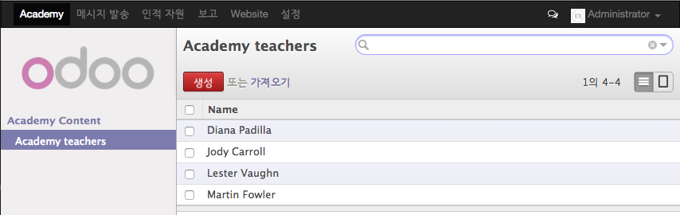

[그림. Academy 관리자 ]

실제 새로운 항목을 추가하면 model에 새롭게 생성됩니다.

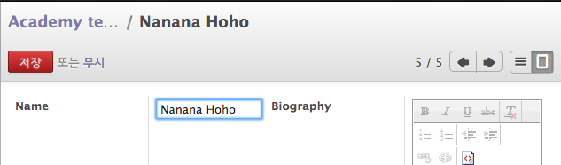 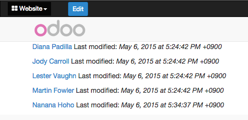

[그림. Academy 관리자에서 새로운 Academy 항목 추가 ]


뷰의 메뉴 항목과 화면 사이의 관계를 살펴보면 다음과 같습니다.

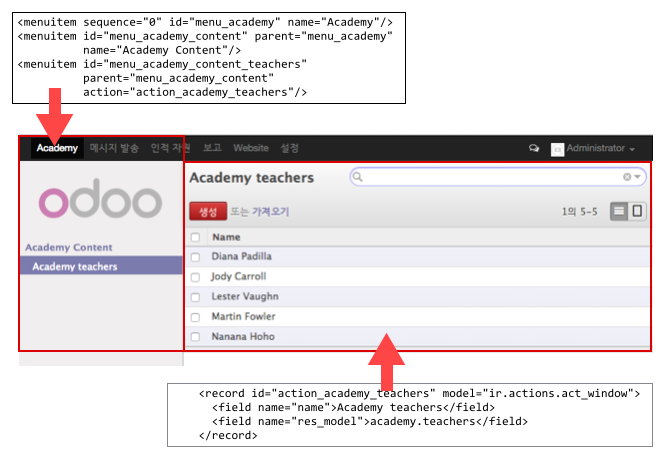
[그림. 뷰 메뉴와 화면 구성]


#### 레코드 폼 추가
views.xml 에 항목의 상세 정보를 볼 수 있는 폼을 추가할 수 있습니다.

```xml
<openerp>
  <data>
    <record id="action_academy_teachers" model="ir.actions.act_window">
      <field name="name">Academy teachers</field>
      <field name="res_model">academy.teachers</field>
    </record>

    <record id="academy_teacher_form" model="ir.ui.view">
      <field name="name">Academy teachers: form</field>
      <field name="model">academy.teachers</field>
      <field name="arch" type="xml">
        <form>
          <sheet>
            <label for="name"/> <field name="name"/>
            <label for="biography"/>
            <field name="biography"/>
          </sheet>
        </form>
      </field>
    </record>

    <menuitem sequence="0" id="menu_academy" name="Academy"/>
    <menuitem id="menu_academy_content" parent="menu_academy"
              name="Academy Content"/>
    <menuitem id="menu_academy_content_teachers"
              parent="menu_academy_content"
              action="action_academy_teachers"/>
  </data>
</openerp>
```


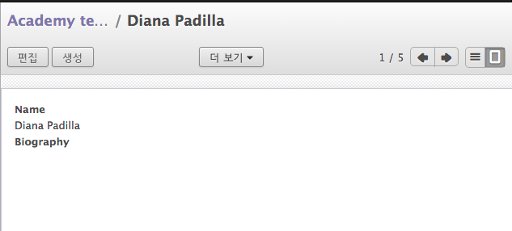
[그림. view 화면에 폼 양식 추가]


#### 모델 사이의 관계
직접적으로 레코드 안의 '기본' 필드를 살펴보았습니다. '[기본 필드](https://www.odoo.com/documentation/8.0/reference/orm.html#reference-orm-fields-basic)'에는 여러가지가 있습니다.
선생님이 학습 코스를 사용하기 위해서 Course 모델을 작성하고 각 코스는 선생님을 가르키는 teacher 필드를 갖도록 해보자.


파일: academy/models.py
```python
class Courses(models.Model):
   _name = 'academy.Courses'

   name = fields.Char()
   teacher_id = fields.Many2one('academy.teachers', string="Teacher")
```

Course 모델에 대한 접근 권한을 추가합니다.

파일: academy/security/ir.model.access.csv
```
id,name,model_id:id,group_id:id,perm_read,perm_write,perm_create,perm_unlink
access_academy_teachers,access_academy_teachers,model_academy_teachers,,1,0,0,0
access_academy_courses,access_academy_courses,model_academy_courses,,1,0,0,0
```

뷰에 코스에 대한 정보를 보고 수정 할 수 있도록 추가합니다. 

파일: academy/views.xml
```xml

  <record id="action_academy_courses" model="ir.actions.act_window">
    <field name="name">Academy courses</field>
    <field name="res_model">academy.courses</field>
  </record>
  <record id="academy_course_search" model="ir.ui.view">
    <field name="name">Academy courses: search</field>
    <field name="model">academy.courses</field>
    <field name="arch" type="xml">
      <search>
        <field name="name"/>
        <field name="teacher_id"/>
      </search>
    </field>
  </record>
  <record id="academy_course_list" model="ir.ui.view">
    <field name="name">Academy courses: list</field>
    <field name="model">academy.courses</field>
    <field name="arch" type="xml">
      <tree string="Courses">
        <field name="name"/>
        <field name="teacher_id"/>
      </tree>
    </field>
  </record>
  <record id="academy_course_form" model="ir.ui.view">
    <field name="name">Academy courses: form</field>
    <field name="model">academy.courses</field>
    <field name="arch" type="xml">
      <form>
        <sheet>
          <label for="name"/>
          <field name="name"/>
          <label for="teacher_id"/>
          <field name="teacher_id"/>
        </sheet>
      </form>
    </field>
  </record>

    <menuitem sequence="0" id="menu_academy" name="Academy"/>
    <menuitem id="menu_academy_content" parent="menu_academy"
              name="Academy Content"/>
<!-- Course menu -->
    <menuitem id="menu_academy_content_courses"
              parent="menu_academy_content"
              action="action_academy_courses"/>
<!-- Teacher menu -->
    <menuitem id="menu_academy_content_teachers"
              parent="menu_academy_content"
              action="action_academy_teachers"/>
```

여기까지 작업하고 서비스를 재시작해 살펴보면 다음 같이 새로운 'Academy Teacher' 메뉴가 생성되고 cource 뷰가 만들어 진것을 확인할 수 있습니다.

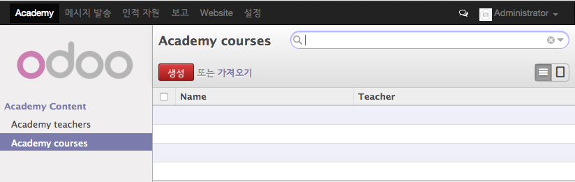
[그림. Course 메뉴와 Course view ]


새로운 코스를 teacher의 페이지에서 생성하거나 teacher의 모든 코스를 볼 수 있어야 합니다. 그래서 teacher 모델에 역관계인 [One to Manu 관계인 inverse relationship](https://www.odoo.com/documentation/8.0/reference/orm.html#openerp.fields.One2many)를 추가할 수 있습니다.

파일: academy/models.py
```python

class Teachers(models.Model):
    _name = 'academy.teachers'

    name = fields.Char()
    biography = fields.Html()
    course_ids = fields.One2many('academy.courses', 'teacher_id', string="Courses")


class Courses(models.Model):
   _name = 'academy.courses'
```

그리고 academy_teacher_form 레코드에 course_ids 관련 필드를 추가한다.
파일: academy/views.py
```python
    <record id="academy_teacher_form" model="ir.ui.view">
      <field name="name">Academy teachers: form</field>
      <field name="model">academy.teachers</field>
      <field name="arch" type="xml">
        <form>
          <sheet>
          <label for="name"/> <field name="name"/>

          <label for="biography"/>
          <field name="biography"/>

          <field name="course_ids">
            <tree string="Courses" editable="bottom">
              <field name="name"/>
            </tree>
          </field>
        </sheet>
        </form>
      </field>
    </record>
```


### Discussions & notifications
odoo가 제공하는 모듈중에 비즈니스를 채워주는 기술 모델이 있다. 그중 'Chatter' 시스템은 이메일과 메시징 시스템이다. notifications와 discussion을 모델에 더해 줄 수 있다. 

- 참조: [How To mail_openchatter](https://doc.odoo.com/trunk/mail/mail_openchatter_howto/)

이것은 모델에 간단하게 '[_inherit](https://www.odoo.com/documentation/8.0/reference/orm.html#openerp.models.Model._inherit)='mail.thread'를 추가한다.

'academy' 에서 'courses'를 토론할 수 있게 할 수 있다.

머저 __openerp__.py에 메일 시스템 'mail' 의존성을 추가한다.
```python
    'depends': ['base', 'mail'],
```


파일: academy/models.py
```python
class Courses(models.Model):
   _name = 'academy.courses'
   _inherit = ['mail.thread']

   name = fields.Char()
   teacher_id = fields.Many2one('academy.teachers', string="Teacher")
```

가능하고 폼 뷰 'academy_course_form'에 'message_ids' 필드를 더한다.

파일: academy/views.py
```xml
<record id="academy_course_form" model="ir.ui.view">
  <field name="name">Academy courses: form</field>
  <field name="model">academy.courses</field>
  <field name="arch" type="xml">
    <form>
      <sheet>
        <label for="name"/>
        <field name="name"/>
        <label for="teacher_id"/>
        <field name="teacher_id"/>
      </sheet>
      <div class="oe_chatter">
        <field name="message_follower_ids" widget="mail_followers"/>
        <field name="message_ids" widget="mail_thread"/>
      </div>
    </form>
  </field>
</record>
```

이제 코스 양식의 아랫 부분에 discussions 스레드가 보인다.

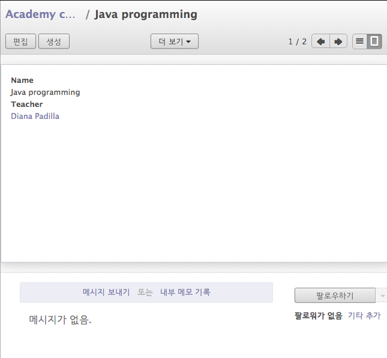

[그림. ]


#### Selling courses

> 'website_sale' 추가시 'Unmet dependencies: ...' 
Odoo는 비즈니스 필요성을 직접 선택하거나 사용할 수 있는 비즈니스 모델을 제공하고 있다. 예를 들어 'website_sale' 모듈은 이커머스 사이트를 구축할 수 있다.
여기서 학습 코스를 특수한 제품으로 만들어 판매할 수 있게 코스 가입을 만들 수 있다.
앞서 전통적 상속보다 코스 모델을 제품 모델로 교체하고 확장한다.
Rather than the previous classical inheritance, this means replacing our course model by the product model, and extending products in-place (to add anything we need to it).

먼저 website_sale 의존성을 추가한다.

파일: academy/__openerp__.py
```python
    'version': '0.1',

    'depends': ['base', 'mail'],

```

Odoo를 재시작하면 웹사이트에 'Shop' 구획이 보인다.


