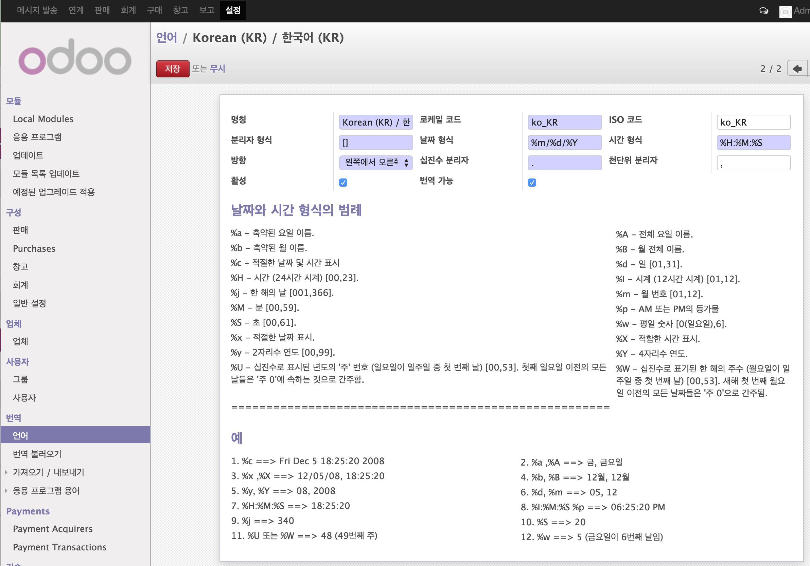

# Administrator
관리를 하기 위해서 Administrator 관리자 권한이 필요하다.

## 언어 설정
각 국가/언어 별로 필요한 설정을 할 수 있다.
 - 날짜 형식, 텍스트 방향, 숫자, 통화 등등.

[그림. Odoo 설정 / 언어 설정]

### 숫자 형식
각 언어에 다른 구분자 형식을 설정할 수 있다.

Settings > Translations > Languages에서 '구분자 형식'에 패턴을 정한다.

숫자 형식에 세가지 선택이 있다::
 - 구분자 형식: 숫자 단위의 구분자
 - 천단위 구분자: 구분 구간에 표시되는 문자
 - 십진 구분자: 십진수 이전에 표시되는 문자

#### 구분자 형식
구분자 형식에 [3,3,3,-1] 를 사용하면 숫자 1232345.01는 1,232,345.01 같이 표시될 것이다. 그러나 숫자  1237891232345.01는 1237'891'232'345.01 로 표시될 것이다.
마지막 '-1'은 리스트의 끝을 지시하여 '구분을 멈춤'을 의미한다. '0'은 'repeat the last group at infinite'
그래서 숫자의 3단위 마다 구분은 [3,0] 을 사용하면 된ㄷ.

> 참고 https://www.odoo.com/forum/help-1/question/how-to-define-the-thousands-separator-88

